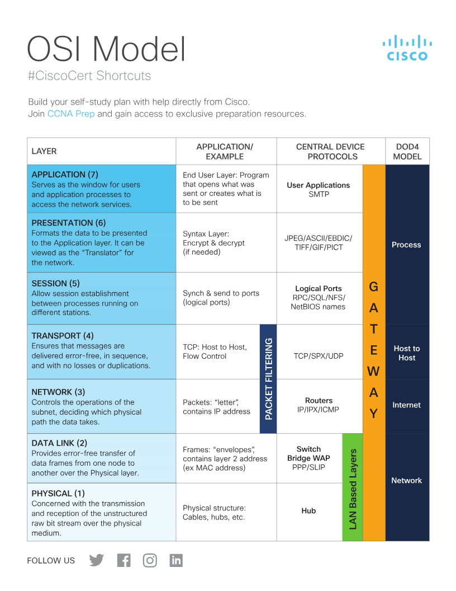
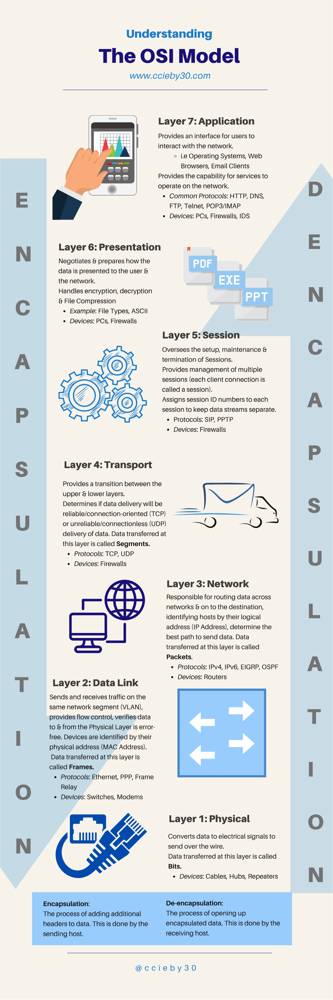

# The OSI Model

Notes from:
- Video: [OSI and TCP IP Models - Best Explanation](https://www.youtube.com/watch?v=3b_TAYtzuho) (YouTube)
- Article: [Le modèle OSI](https://blog.stephane-robert.info/docs/reseaux/fondamentaux/modele-osi/) — Stéphane Robert
- Article: [Modèles TCP/IP et OSI](https://cisco.goffinet.org/ccna/fondamentaux/modeles-tcp-ip-osi/) — CCNA course notes (Goffinet)

## What it is

The **OSI model** (Open Systems Interconnection) is a 7-layer conceptual framework
for how data moves across a network, from the application that generates it down
to the physical medium and back up again on the receiving end. It's a *reference*
model — real-world stacks (like TCP/IP) don't implement it layer-for-layer, but it's
the shared vocabulary the industry uses to talk about where a problem lives ("that's
a layer 3 issue").

Each layer:
- only talks to the layers directly above and below it,
- offers a service to the layer above,
- adds its own header (encapsulation) to the data it receives from the layer above.

## The 7 layers

| # | Layer | PDU (unit of data) | Job | Examples / protocols |
|---|--------------|---------------------|-----|-----------------------|
| 7 | Application | Data | The actual network service the user-facing app talks to | HTTP, DNS, SMTP, SSH, FTP |
| 6 | Presentation | Data | Format, encode, encrypt/decrypt — translates between application format and the wire | TLS/SSL, JPEG, ASCII/Unicode |
| 5 | Session | Data | Opens, manages, and closes the conversation between two hosts | RPC, sockets, NetBIOS |
| 4 | Transport | Segment (TCP) / Datagram (UDP) | End-to-end delivery: ports, reliability, ordering, flow control | TCP, UDP |
| 3 | Network | Packet | Logical addressing and routing between networks | IP, ICMP |
| 2 | Data Link | Frame | Physical/MAC addressing, framing, error detection on the local link | Ethernet, Wi-Fi (802.11), ARP |
| 1 | Physical | Bit | Raw bit transmission over the medium — voltages, light, radio | Cables, fiber, RJ45, radio waves |

Mnemonic (top → bottom): **A**ll **P**eople **S**eem **T**o **N**eed **D**ata **P**rocessing.
French mnemonic from the article, top → bottom: *"Après Plusieurs Saisons, Tout Refroidit
La Planète"*. Bottom → top: *"Pour Le Réseau, Tout Se Passe Automatiquement"*.

## Encapsulation

Going down the stack, each layer wraps the data from the layer above with its own
header (and sometimes a trailer):

```
Application data
  → + Transport header   = Segment (TCP) / Datagram (UDP)
    → + Network header   = Packet
      → + Data Link header/trailer = Frame
        → transmitted as raw Bits
```

The receiving host reverses the process one layer at a time — **decapsulation** —
stripping each header as it hands the payload up to the next layer.

## Where specific protocols actually sit

Not everything maps to a single, clean layer:

- **ARP** resolves an IP address to a MAC address, so it's often described as
  "layer 2.5" — it serves layer 3 (IP) but operates with layer 2 addresses.
- **TLS/SSL** is commonly drawn at layer 6 (it formats/encrypts), but in practice it
  sits between the transport and application layers.
- **ICMP** rides inside IP packets but is considered a layer 3 protocol (it's used
  for diagnostics/control, e.g. `ping`, `traceroute`).

## Addressing and devices, layer by layer

Each layer has its own way of naming "who this is for," and networking gear is
usually described by the *highest* layer it needs to understand to do its job:

| Layer | Identifies an endpoint by | Example | Typical device that operates here |
|---|---|---|---|
| 7 Application | protocol + domain name | `https://www.example.com` | — |
| 4 Transport | port number | `TCP 443` (HTTPS) | firewalls/NAT that filter or translate by port |
| 3 Network | IP address | `192.168.1.10/24` | router |
| 2 Data Link | MAC address | `70:56:81:bf:7c:37` | switch |
| 1 Physical | — (no addressing, just signal) | voltage/light pulses | hub, cabling, NIC |

A **socket** is the pairing of an IP address and a port number
(`192.168.1.10:443`) — it's what actually identifies "this specific
conversation, to this specific service, on this specific host," and it's the
handle TCP uses to keep a connection straight.

This also makes the TCP vs. UDP distinction concrete: both are layer-4
protocols, but **TCP** is connection-oriented and reliable (it opens a session,
numbers and acknowledges everything, retransmits losses), while **UDP** is
connectionless and makes no delivery guarantees — it just sends.

> The device-to-layer mapping above is the simplified version. In practice a
> modern firewall (or IDS) can inspect all the way up to layer 7 — see the
> "devices" column in the cheat sheets below, which lists firewalls at almost
> every layer for that reason.

## OSI vs. TCP/IP model

The TCP/IP model (what the internet actually runs on) collapses OSI's 7 layers into 4:

| TCP/IP layer | Corresponds to OSI layers |
|---|---|
| Application | 7 Application + 6 Presentation + 5 Session |
| Transport | 4 Transport |
| Internet | 3 Network |
| Link (Network Access) | 2 Data Link + 1 Physical |

## Troubleshooting bottom-up

Because each layer depends on the one below it, network troubleshooting typically
goes bottom-up:

1. **L1/L2** — Is the cable/link up? Link lights on? Interface up?
2. **L2** — Can the host resolve/reach the local segment (ARP working)?
3. **L3** — Does the host have a valid IP, and is routing working (`ping`, `traceroute`)?
4. **L4** — Is the remote port open/listening (`telnet`/`nc` to the port)?
5. **L7** — Is the application actually responding correctly (curl the URL, check DNS)?

## Cheat sheets

Two reference posters, for a quick visual recap rather than reading prose:



*Cisco's #CiscoCert Shortcuts table — same 7 layers, plus the older 4-layer DoD
model mapping and a top-to-bottom "GATEWAY" mnemonic (a different acrostic from
"All People Seem To Need Data Processing," same idea).*



*ccieby30's "Understanding the OSI Model" — per-layer protocol lists (including
routing protocols like EIGRP/OSPF at layer 3, and PPP/Frame Relay at layer 2)
and the encapsulation/de-encapsulation definitions side by side.*

## Quiz

Self-test on this material: **[OSI Stack Quiz](https://claude.ai/artifact/8C8YagcECjLUXGbv8tqD1G)**
— draws 10 random questions from a pool of 32 each time, so it's reusable. Covers the
7 layers, encapsulation order, ARP/TLS/ICMP placement, the OSI-vs-TCP/IP mapping,
sockets, TCP vs. UDP, and device-to-layer mapping. Supports skip / previous /
jump-to-question navigation, and keeps your progress in the browser if you refresh.
