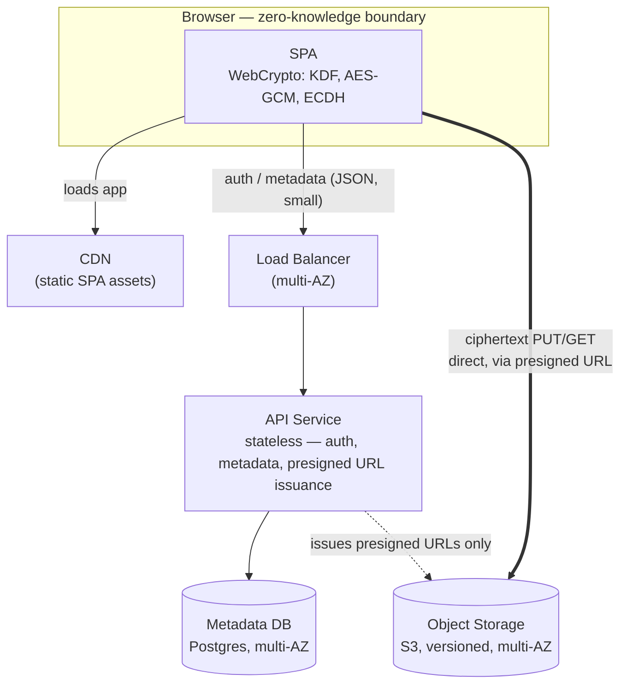
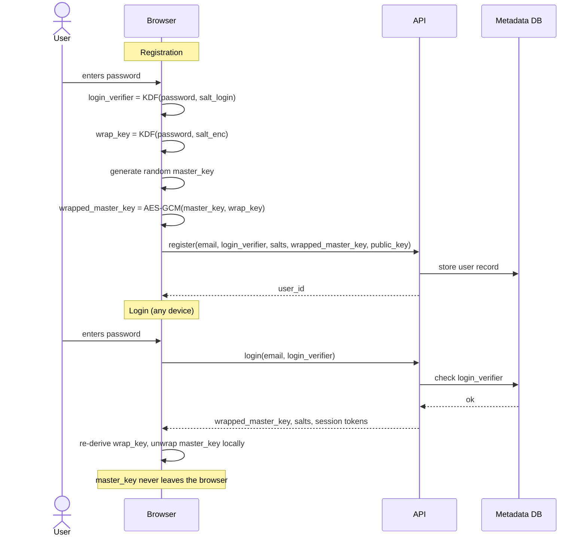
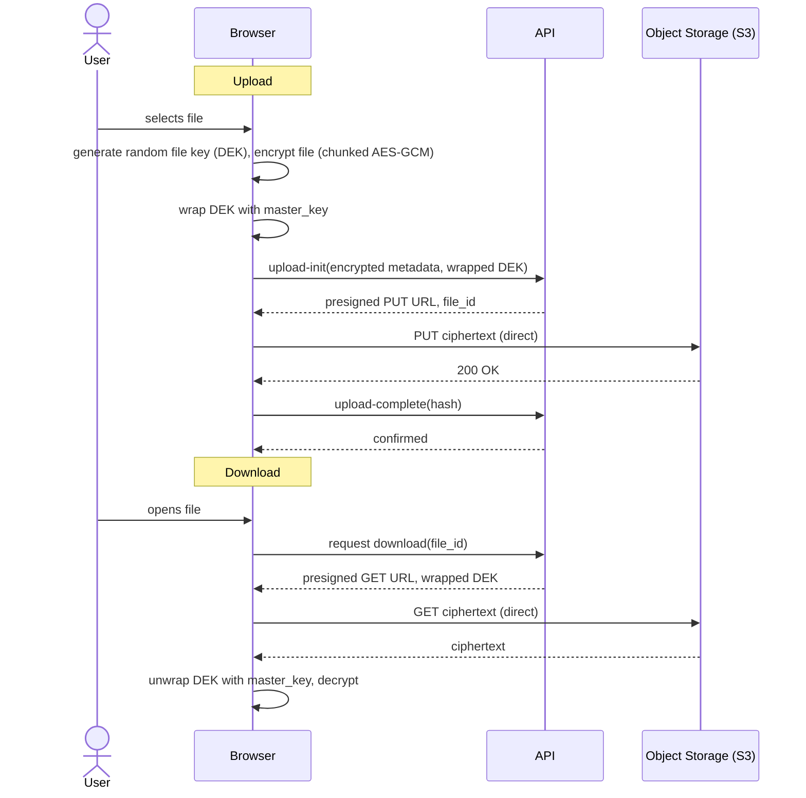
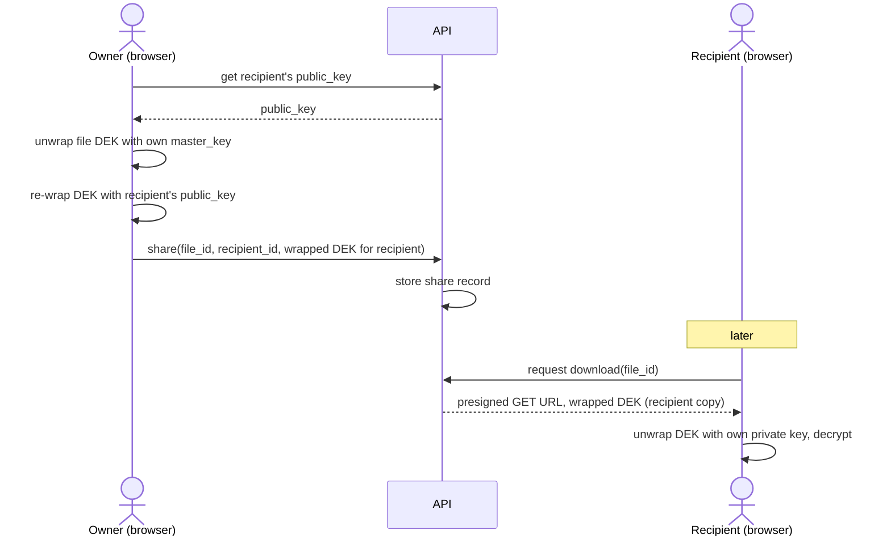

# System Design: Client-Side Encrypted File Storage (Zero-Knowledge Cloud Drive)

## Requirements

**Functional**
- Register/login (email + password)
- Upload files — encrypted in the browser *before* any bytes leave the client
- Download files — fetched as ciphertext, decrypted in the browser
- Organize files into folders, list/browse them
- Share a file with another user without the server ever seeing plaintext or keys
- Delete files

**Non-functional**
- Scale: a few hundred users, low absolute QPS — this is not a "scale" problem, it's a *correctness/security* problem
- Latency: perceived speed dominated by network transfer + client-side crypto, not backend hops — minimize server round-trips on the upload/download path
- Availability: "max availability" with a tiny team → lean on managed services (multi-AZ RDS, S3) rather than building HA primitives by hand
- Consistency: strong consistency for metadata (file list, ACLs); object storage's read-after-write consistency is sufficient for blobs
- Durability: files must never be lost — versioned, replicated object storage
- **Security constraint (the actual design driver): zero-knowledge.** The server must never possess plaintext file content or any key capable of decrypting it.

**Out of scope**
- Server-side search over file content (impossible under true E2EE)
- Real-time collaborative editing
- Native mobile apps
- Multi-region global distribution (single region, multi-AZ is enough at this scale)

---

## Capacity Estimates

At "a few hundred users" the traffic math is almost a formality — the interesting constraints are storage/bandwidth shape, not QPS.

| Metric | Calculation | Result |
|---|---|---|
| DAU | ~40% of 500 users | ~200 |
| Ops/user/day (up+down+list) | 10 | 2,000 ops/day |
| Avg QPS | 2,000 / 86,400 | ~0.02 QPS |
| Peak QPS (5x burst) | 0.02 × 5 | ~0.1 QPS |
| Avg file size | 5 MB | — |
| Files/user | 50 | 25,000 files total |
| Total storage (raw) | 25,000 × 5 MB | ~125 GB |
| 3-year storage w/ 5x growth | 125 GB × 5 | ~625 GB |
| Peak concurrent uploads | 20 users × 5 MB | ~100 MB burst |

**Takeaway:** a single small API instance (or a serverless function) and a single small Postgres instance, both multi-AZ, comfortably cover this. Don't build for scale you don't have — spend the engineering budget on the crypto architecture instead.

---

## Architecture

Only **ciphertext and wrapped keys** ever cross the boundary out of the browser. The API is on the metadata path, never the byte-heavy path — file transfer goes browser↔S3 directly, so its availability mostly inherits S3's SLA rather than the API's.

## Component Breakdown

| Component | Role | Rationale |
|---|---|---|
| SPA (browser) | Does all crypto: key derivation, encrypt/decrypt, key wrapping | Native WebCrypto primitives; server never sees plaintext or usable keys |
| CDN | Serves SPA static assets | Fast delivery, offloads the API |
| Load balancer | Distributes API traffic across AZs | Cheap HA at this scale |
| API service | Auth, folder/file metadata, presigned URL issuance | Stateless → trivial to restart/scale; a security boundary, not a compute bottleneck |
| Metadata DB | Encrypted filenames, folder tree, wrapped per-file keys, sharing ACLs | Strong consistency for listings/permissions; dataset small enough to need no sharding |
| Object storage | Encrypted blobs only | Durable, direct client access bypasses the API for the heavy path |

---

## Key Flows

### Account creation & login

Two independent secrets are derived from one password so the server can authenticate the user without ever learning the key that decrypts data.

### Upload & download

### Sharing

---

## Deep Dives

### 1. Zero-knowledge key management (the core hard problem)

- Deriving `login_verifier` and `master_key` from the same password via different KDF contexts is what lets the server authenticate the user without ever holding the decryption key.
- Wrapping a randomly-generated `master_key` (rather than deriving it directly from the password) means a password change only requires re-wrapping one key, not re-encrypting every file.
- Per-file DEKs, wrapped individually, bound the blast radius of any single key leak and make sharing/revocation tractable.
- **Fundamental, unavoidable tradeoff:** forgotten password = unrecoverable data, unless a one-time **recovery key** was generated and stored by the user at signup. There is no password-reset email that can save this — it must be a clearly communicated, informed choice at signup.

### 2. Streaming encryption for large files in the browser

`SubtleCrypto` AES-GCM isn't meant to encrypt an entire large file in one call, and loading it fully into memory isn't viable on typical browser budgets either. Files are split into fixed-size chunks, each encrypted independently with a **per-chunk nonce that never repeats under the same key** (nonce reuse in GCM is a catastrophic key-recovery bug, not a cosmetic one), and uploaded via multipart. This also buys resumability for free: a closed tab can resume from the last completed chunk.

### 3. Sharing without breaking zero-knowledge

Per-file DEKs make this clean: the owner unwraps the DEK locally, re-wraps it with the recipient's public key, and sends only the wrapped result — the server only ever stores ciphertext-wrapped keys. The weak point is **revocation**: removing a share stops future API-mediated access, but a recipient who already decrypted the file keeps that copy. True revocation needs DEK rotation + re-encryption, which is expensive enough to document as a known limitation rather than solve at this scale.

### 4. Search, solved by *not* building infrastructure for it

At a few hundred users, fetch the small list of encrypted filenames for a folder and decrypt/filter client-side — no server-side search index needed. This wouldn't hold up at millions of files, but it's the right-sized answer here.

---

## Failure Modes

| Component | Failure | Detection | Recovery |
|---|---|---|---|
| Object storage | Upload interrupted mid-transfer | Missing/incomplete multipart parts | Resume from last completed chunk |
| Object storage | Ciphertext tampered/corrupted | Hash mismatch on `upload-complete`, or GCM auth-tag failure on decrypt | Reject object, prompt re-upload; corruption fails loudly, never silently |
| Metadata DB | Instance failure | Managed health checks | Automatic failover to standby (multi-AZ), <1 min |
| Presigned URL | Expires mid-upload | Client-side 403 on PUT | Client requests a fresh URL for remaining parts |
| API service | Instance crash | LB health check | Auto-restart/replace; ≥2 instances across AZs → no perceived downtime |
| User | Forgets password, no recovery key | N/A — self-inflicted | Data is unrecoverable by design; must be an explicit, informed choice at signup |
| Browser | Tab closed mid-upload | Missing completion event | Resume from persisted chunk progress on next visit |
| CDN | Regional outage | Uptime monitoring | Secondary edge/fallback origin (cheap insurance at this scale) |

---

## Tradeoffs

1. **Zero-knowledge over recoverability** — the operator cannot help a user who loses their password without a pre-established recovery key. A UX cost paid for a real privacy guarantee.
2. **Direct-to-storage transfer over API-proxied transfer** — lower latency and no API load on the byte-heavy path, at the cost of an explicit `upload-complete` verification step instead of inline validation.
3. **Managed services over custom HA infrastructure** — at a few hundred users, hand-rolled sharding/replication would be pure overhead; multi-AZ managed Postgres + S3 gets "max availability" essentially for free.
4. **No server-side search** — fetch-and-filter client-side caps the feature at small datasets but keeps the zero-knowledge guarantee intact and the system simple.
5. **Chunked AES-GCM over single-shot encryption** — adds nonce-management responsibility, but is required by browser memory limits and is what makes resumable transfer possible.
